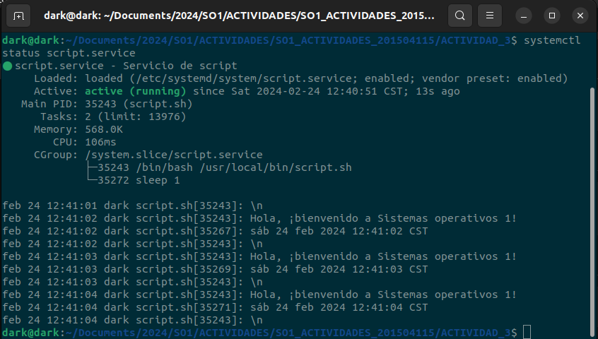

# ACTIVIDAD 3
## 1. Se crea el scrip llamado script.sh
### Aqui creamos un while e imprimimos un mensaje y la fecha actual con una pausa de 1 segundo.
```bash
while true; do
    echo "Hola, ¡bienvenido a Sistemas operativos 1!"
    date
    echo "\n"
    sleep 1
done
```

## 2. Se Guarda este script en una ubicación conveniente /usr/local/bin/script.sh.

## 3. Le damos permiso de ejecucion al script.sh
```bash
sudo chmod +x /usr/local/bin/script.sh

```

## 4. Ahora, crea un archivo de unidad de systemd llamado script.service en el directorio </br>/etc/systemd/system/ </br> o en  </br>/lib/systemd/system/ </br> Se usa nano para editar el archivo:

```bash
sudo nano /etc/systemd/system/script.service

```
## 5. Dentro del archivo script.service, agrega el siguiente contenido:

```bash
[Unit]
Description=Servicio de script

[Service]
Type=simple
ExecStart=/usr/local/bin/script.sh
Restart=always
RestartSec=1

[Install]
WantedBy=multi-user.target

```

## 6. Guarda el archivo y cierra el editor.

## 7. Habilitar el servicio para que se inicie con el sistema:
```bash
sudo systemctl enable script.service

```

## 8. Para iniciar el servicio inmediatamente, ejecuta:
```bash
sudo systemctl start script.service
```
## 9. Verificar el estado del servicio
```bash
systemctl status script.service

```

## 10. Parar el servicio
```bash
sudo systemctl stop script.service
```

## 11. Reiniciar el servicio
```bash
sudo systemctl restart script.service
```

# SALIDAS
## 1. Ejecucion de script


## 2. Verificamos nuestro servicio y como podemos observar en la siguiente imagen, se esta ejecutando el script, imprimiendo el saldudo "Hola, ¡bienvenido a Sistemas operativos 1!" y la fecha actual.


## 3. Paramos nuestro servicio con el comando sudo systemctl stop script.service y en la siguiente imagen podemos ver el servicio desactivado.
