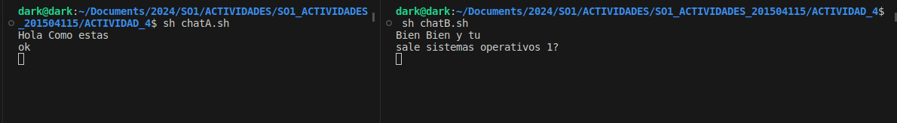
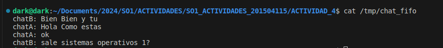

# Chat Basico con Named Pipes
## 1. Se crean dos scripts bash,"chatA.sh" y "chatB.sh".
### chatA.sh
```sh
#!/bin/bash

# chatA.sh
# Definir el nombre del FIFO
PIPE=/tmp/chat_fifo

# Crear el FIFO si no existe
[ -p $PIPE ] || mkfifo $PIPE

# Bucle para leer mensajes y enviarlos
while true; do
    read mensajeA
    echo cat $PIPE &"chatA: $mensajeA" >> $PIPE 
done

```
### chatB.sh
```sh
#!/bin/bash

# chatB.sh
# Definir el nombre del FIFO
PIPE=/tmp/chat_fifo

# Crear el FIFO si no existe
[ -p $PIPE ] || mkfifo $PIPE

# Bucle para leer mensajes y enviarlos
while true; do    
    read mensajeB
    echo "chatB: $mensajeB" >> $PIPE
done

```

## 2. Darle permisos de ejecución a ambos scripts:

```sh
chmod +x chatA.sh chatB.sh

```

## 3.Ejecutar los scripts en dos terminales diferentes:
```sh

sh chatA.sh
sh chatB.sh
```
## 4. Ejecucion de chat


## 5. Salida de chat

