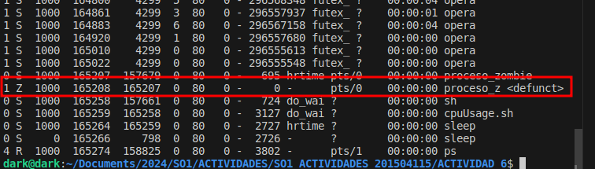

## 1. Explique cuál es la diferencia entre Scheduling Permisivo y No Permisivo.
### Scheduling Permisivo: En un sistema con un enfoque permisivo, el cambio de contexto entre procesos puede ocurrir en cualquier momento, incluso si un proceso en ejecución no está esperando explícitamente una operación de E/S (Entrada/Salida) u otro evento. Esto significa que el sistema operativo puede interrumpir un proceso en cualquier momento para asignar la CPU a otro proceso, incluso si el proceso actual está en medio de una tarea crítica. Ejemplos de sistemas operativos con un enfoque permisivo son algunos sistemas basados en Unix.

### Scheduling No Permisivo: En un enfoque no permisivo, el cambio de contexto solo ocurre cuando el proceso en ejecución está esperando activamente una operación de E/S u otro evento que requiera una espera explícita (como la liberación de un recurso). Esto significa que un proceso en ejecución no será interrumpido arbitrariamente por el sistema operativo, lo que puede ser beneficioso para aplicaciones que requieren tiempos de respuesta consistentes y predecibles. Ejemplos de sistemas operativos con un enfoque no permisivo son algunos sistemas embebidos en tiempo real.

## 2.Cuál de los siguientes algoritmos de Scheduling podría provocar un bloqueo indefinido?       Explique su respuesta.
###    a. First-come, first-served
###    b. Shortest job first
###    c. Round robin
###    d. Priority

### El algoritmo de Scheduling que podría provocar un bloqueo indefinido es c. Round robin.

### El algoritmo Round Robin es un enfoque de asignación de CPU donde cada proceso recibe una pequeña cantidad de tiempo de CPU de manera cíclica y en orden, independientemente de su prioridad o duración de ejecución. Si un proceso no termina dentro de su quantum asignado, se mueve al final de la cola de listos y el siguiente proceso en la cola recibe la CPU.


## 3. De estos dos tipos de programas:
###    a. I/O-bound (un programa que tiene más I/Os que uso de CPU)
###    b. CPU-bound (un programa que tiene más uso de CPU que I/Os)
### ¿Cuál tiene más probabilidades de tener cambios de contexto voluntarios y cuál tiene más probabilidades de tener cambios de contexto no voluntarios? Explica tu respuesta.

### Programas I/O-bound: Estos programas realizan más operaciones de entrada/salida que operaciones de cálculo de CPU. Cuando un proceso I/O-bound realiza una operación de E/S, generalmente se bloquea, lo que significa que el proceso voluntariamente cede el control de la CPU al sistema operativo mientras espera que se complete la operación de E/S. Como resultado, los cambios de contexto en programas I/O-bound suelen ser voluntarios, ya que el proceso está consciente de su estado de bloqueo y coopera con el sistema operativo para liberar la CPU durante ese tiempo.

### Programas CPU-bound: Estos programas realizan principalmente cálculos intensivos de CPU y tienen menos operaciones de E/S. Debido a su naturaleza intensiva en CPU, estos programas tienden a ocupar la CPU durante períodos prolongados sin ceder el control voluntariamente. Los cambios de contexto en programas CPU-bound son más propensos a ser no voluntarios, ya que ocurren cuando el sistema operativo interviene para asignar la CPU a otro proceso después de que el proceso actual haya utilizado su tiempo de ejecución asignado o cuando se produce un evento que requiere la atención del sistema operativo, como una interrupción de hardware.

## 4. Utilizando un sistema Linux, escriba un programa en C que cree un proceso hijo (fork) que finalmente se convierta en un proceso zombie. Este proceso zombie debe permanecer en el sistema durante al menos 10 segundos. Los estados del proceso se pueden obtener del comando: ps -l
```C
#include <stdio.h>
#include <stdlib.h>
#include <unistd.h>
#include <sys/wait.h>

int main() {
    pid_t child_pid;

    // Crear un proceso hijo
    child_pid = fork();

    if (child_pid < 0) {
        // Error al crear el proceso hijo
        perror("fork");
        exit(EXIT_FAILURE);
    } else if (child_pid == 0) {
        // Código del proceso hijo
        printf("Soy el proceso hijo con PID: %d\n", getpid());
        // El proceso hijo se convierte en zombie
        exit(EXIT_SUCCESS);
    } else {
        // Código del proceso padre
        printf("Proceso padre esperando 10 segundos...\n");
        sleep(10); // Esperar 10 segundos
        // El proceso padre espera al hijo para que no se convierta en zombie permanente
        wait(NULL);
        printf("Proceso hijo ha terminado.\n");
    }

    return 0;
}

```

## CREAMOS UN EJECUTADOR DEL ARCHIVO C CON LOS COMANOD
### 1.Build:   gcc proceso_zombie.c -o proceso_zombie -lpthread
### 2. Run:     ./proceso_zombie
## EJECUTAMOS EL PROGRAMA CREA UN PROCESO CON PID:165208

## Para ver el proceso zombie usamos el siguiente comando.
```sh
ps -el
```
## VIENDO PROCESO ZOMBIE CON PID: 165208


